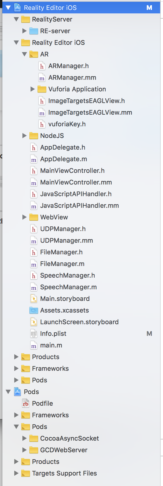

## One Reality App Setup Guide

There is now a **one-reality** branch of the iOS project

- without openFrameworks
- with a self-hosted Node.js server

###How to set up:

0. Make sure you're on the **one-reality** branch of the RE-realityeditor-ios git repository

1. Install cocoapods (like npm but for iOS frameworks) in the terminal using: `sudo gem install cocoapods`
2. Run `pod install` in the project directory to set up the modules.
3. Open the `bin/data` directory and download the **miniServerForIos** branch of the RE-server (https://github.com/PTCInc/RE-server/tree/miniServerForIos) into the folder. The server.js should have the path *bin/data/RE-server/server.js*
4. Download the **one-reality** branch of the RE-userinterface (https://github.com/PTCInc/RE-userinterface/tree/one-reality) to the bin/data folder so that the index.html file has the path _bin/data/userinterface/index.html_
5. Add the private _vuforiaKey.h_ file so that it has the path _Reality Editor iOS/vuforiaKey.h_
6. Download the [Vuforia SDK](https://developer.vuforia.com/downloads/sdk) and copy the Vuforia.framework file into the top level of the RE-realityeditor-ios directory.
6. Open Reality Editor iOS.**xcworkspace** (not the Reality Editor iOS.**xcodeproj** file). This opens a project with all of the modules included. If everything so far has succeeded, the project structure should look like this, and the project should compile:

